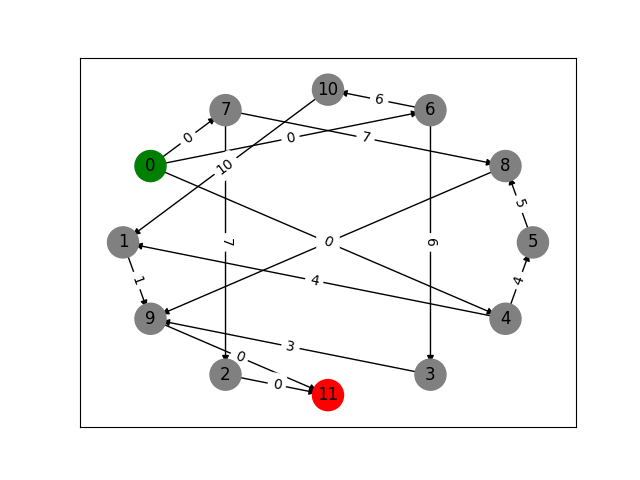

# Projet analyse de graphe : Ordonnancement
## Discipline : Théorie des graphes
### Description

Projet de la matière théorie des graphes de l'Ecole d'ingénieur EFREI, Villejuif.\
À partir de tableaux de contraintes donnés en fichier `.txt` (voir exemple), le but est de trouver les différents chemins (date au plus tard, au plus tôt, ...).

### Exemple de représentation graphique
Le nœud d'entrée est en vert et celui de sortie en rouge.\
S'il y a plusieurs entrées initiales, un nœud égal à 0 est créé.\
En cas de multiples nœuds de sortie, une sortie unique est créée : le nœud N+1 où N est le nombre initial de nœud.

# Auteurs

#### EFREI L3 - S6 - Promo 2026

[Tao Solan](https://github.com/THETASOLA)\
[Quentin Adeline](https://github.com/Quentinadl)\
[Thibaut MENIN](https://github.com/Pulsar94)\
[Marc ROUGAGNOU](https://github.com/MarcEfrei)

# Utilisation

Pour lancer le programme, exécuter le fichier `main.py`.
